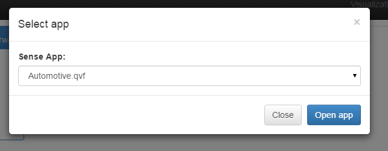
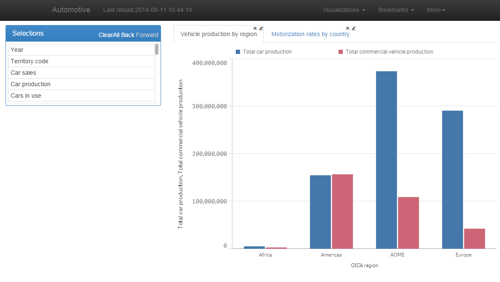
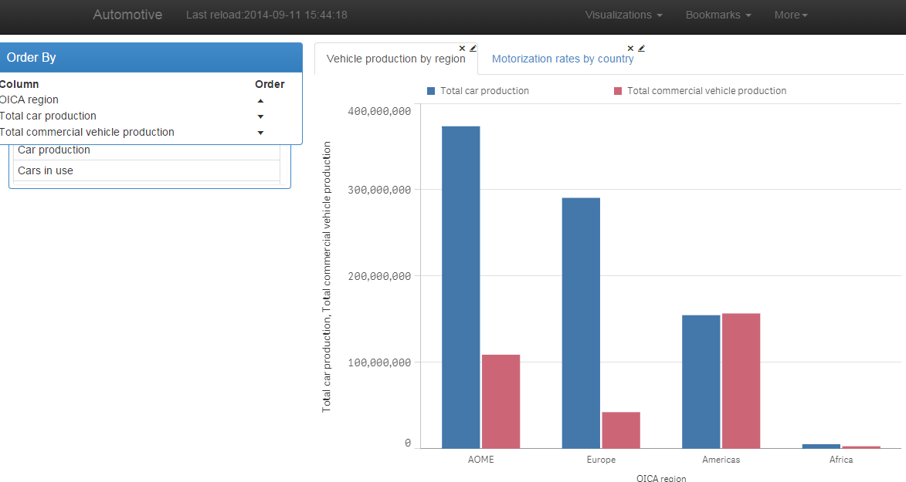

# QonnectionsMashup
Mashup example from Qonnections 2015 presentation.

Qlik Sense 1.1 is required. Install as an extension:

- for desktop: copy files to a directory under My Documents/Qlik/Sense/Extensions

- for server: zip files and install in the QMC

Start with http://localhost:4848/extensions/qonnmashup/qonnmashup.html 
or https://server/extensions/qonnmashup/qonnmashup.html

The mashup will allow you to open any app on your server.

 
You can then add visualizations to the tab container. 

And modify the sort order in visualizations (only works for those based on a hypercube).

Also supports some other operations like applying bookmarks, running a reload, listen to selection state etc.

